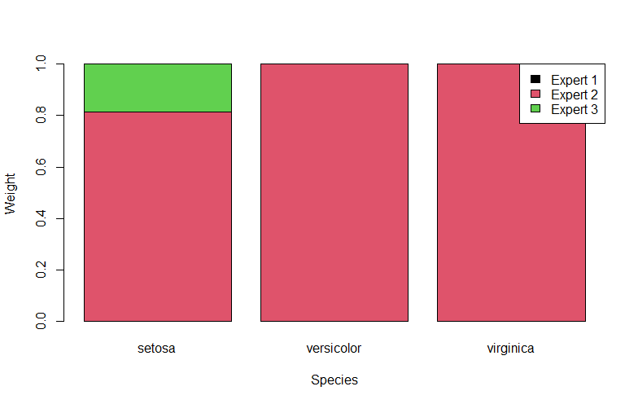

<!-- README.md is generated from README.Rmd. Please edit that file -->

# gamstackr

<!-- badges: start -->
<!-- badges: end -->

gamstackr is used to create probabalistic experts and find optimal weights for each expert given a set of covariates. Weights can depend on fixed, smooth or random effects. The weights are fitted by implementing custom `mgcv` families. We implement several weighting structures, including ordinal, multivariate normal and nested stacking. 

## Installation

You can install the development version of gamstackr from
[GitHub](https://github.com/) with:

``` r
# install.packages("devtools")
devtools::install_github("eenticott/gamstackr")
```

## Stacking procedures
### Multinomial stack
We can implement a multinomial stack using the nested stack family. Each density needs to be in its' own list and we use a list of id functions for the inner functions. The below is pseudo code for setting up this type of stack.

```r
logP = list(den1, den2, den3)
inner_functions = list(id(), id(), id())
stack_fam = NestedStack(logP, inner_functions)
```

### Ordinal stack
```r
logP = list(cbind(den1, den2, den3))
inner_functions = list(ordinal(3))
stack_fam = NestedStack(logP, inner_functions)
```

### 
## Example

This is a simple example of implementing a stacking model using the iris data set in R. We fit three experts that aim to predict `Sepal.Length` using the other numeric columns in the data set. We fit a multinomial stack using the `NestedStack` family.

``` r
library(gamstackr)
library(mgcv)

data("iris")

ex1 <- lm(Sepal.Length ~ Sepal.Width, data = iris)
ex2 <- lm(Sepal.Length ~ Petal.Length, data = iris)
ex3 <- lm(Sepal.Length ~ Petal.Width, data = iris)

den1 <- matrix(dnorm(iris$Sepal.Length, predict(ex1), sd(ex1$residuals), log = TRUE))
den2 <- matrix(dnorm(iris$Sepal.Length, predict(ex2), sd(ex2$residuals), log = TRUE))
den3 <- matrix(dnorm(iris$Sepal.Length, predict(ex3), sd(ex3$residuals), log = TRUE))

stack_fam = NestedStack(list(den1, den2, den3), list(id(), id(), id()))

stack <- gam(list(Sepal.Length ~ Species,  ~Species), data = iris, family = stack_fam)

W <- predict(stack, type = "response")

barplot(t(unique(W[,1:3])), col = unique(iris$Species), 
        names.arg = unique(iris$Species), xlab = "Species", ylab = "Weight")
legend("topright", legend = c("Expert 1", "Expert 2", "Expert 3"), fill = unique(iris$Species))


```
We see that overall expert 2 is given by far the most weight but expert 1 appears to be useful for the setosa species.



