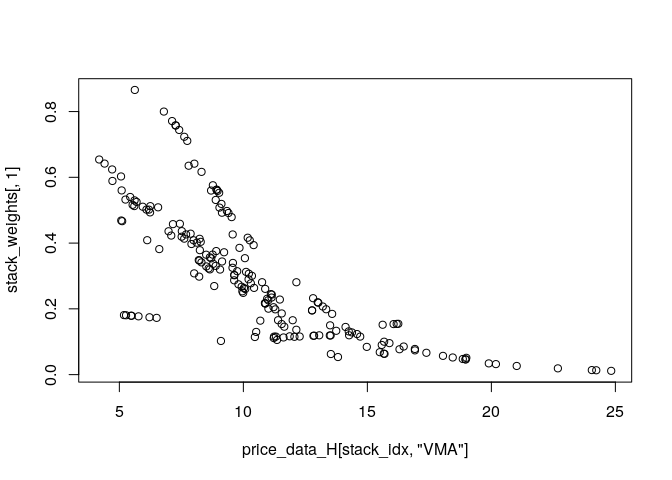

# gamstackr

<!-- badges: start -->
[](https://lifecycle.r-lib.org/articles/stages.html#experimental)
[](https://github.com/eenticott/gamstackr/actions)
<!-- badges: end -->

**gamstackr** is an R package for probabilistic density stacking and expert combination in time series forecasting. It provides a flexible framework for combining multiple forecasting models (experts) through sophisticated weighting schemes, particularly useful for electricity price forecasting and other time series applications.

## Key Features

- **Flexible Expert Definition**: Create custom forecasting experts with any underlying model
- **Multiple Stacking Methods**: Support for ordinal, multivariate normal, and identity weight functions
- **Time Series Windows**: Built-in tools for sliding and expanding window analysis
- **Density Combination**: Combine probabilistic forecasts rather than just point forecasts
- **GAM Integration**: Seamless integration with Generalized Additive Models via mgcv
- **Performance Optimized**: C++ backend via Rcpp for computational efficiency

## Installation

You can install the development version of gamstackr from [GitHub](https://github.com/eenticott/gamstackr) with:

```r
# install.packages("devtools")
devtools::install_github("eenticott/gamstackr")
```

## Core Workflow

The **gamstackr** workflow consists of four main steps:

1.  **Define experts** - Create forecasting models with custom fitting and density functions
2.  **Create windows** - Set up time series analysis windows (sliding or expanding)
3.  **Evaluate experts** - Fit experts across windows and generate predictions/densities
4.  **Stack results** - Combine expert forecasts using sophisticated weighting schemes

## Quick Start

Here's a simple example demonstrating the core workflow:

```r
library(gamstackr)

# 1. Define experts with custom fitting and density functions
fit_func <- function(data) {
  mgcv::gam(SpotPrice ~ s(LagMatrix, by = LoadMatrix) + Nuclear_availability, 
            data = data)
}

dens_func <- function(fitted_model, data) {
  mu <- predict(fitted_model, data)
  sd <- sqrt(fitted_model$sig2)
  dnorm(data[,"SpotPrice"], mu, sd, log = TRUE)
}

expert1 <- create_expert(fit_func, dens_func = dens_func)

# 2. Create windowing strategy
windower <- create_windower(
  horizon_size = 7, 
  window_size = 12*7, 
  step_size = 7, 
  type = "sliding"
)

# 3. Evaluate experts across windows
expert_results <- evaluate_expert(expert1, windower, your_data, 
                                  type = c("predict", "density"))

# 4. Create and fit stacker
stacker <- create_stacker(list(list(expert1)), weight_func = list(ordinal(1)))
stack_results <- evaluate_stack(stacker, SpotPrice ~ 1, windower, 
                               your_data, expert_densities)
```

## Time Series Windows

**gamstackr** supports two main types of windows for time series analysis:

### Sliding Windows
Fixed-size windows that move through time. Useful when older data becomes less relevant.

```r
# Create sliding window
slide_window <- create_windower(
  horizon_size = 7, 
  window_size = 12*7, 
  step_size = 7, 
  type = "sliding"
)

df_slide <- slide_window(price_data_H)
plot_windows(df_slide)
```


### Expanding Windows  
Growing windows that accumulate historical data. Useful when trends are expected to remain stable.

```r
# Create expanding window
expand_window <- create_windower(
  horizon_size = 7, 
  window_size = 12*7, 
  step_size = 7, 
  type = "expanding"
)

df_expand <- expand_window(price_data_H)
plot_windows(df_expand)
```


## Creating Experts

Define custom forecasting experts by specifying fitting and density functions:

### Expert Components
- `fit_func`: Function to train the model on data
- `dens_func`: Function to evaluate probability densities  
- `pred_func`: (Optional) Custom prediction function

### Example Expert Definition

```r
# Define fitting function
    fit_func <- function(data) {
  data <- tail(data, 7*4) # Use last 4 weeks of data
  gam(SpotPrice ~ s(LagMatrix, by = LoadMatrix) + Lag_J1_GazPrice + 
      Nuclear_availability + M1_Oil + M1_Coal, data = data)
    }

# Define density function
    dens_func <- function(fitted_model, data) {
      mu <- predict(fitted_model, data)
      sd <- sqrt(fitted_model$sig2)
      dnorm(data[,"SpotPrice"], mu, sd, log = TRUE)
    }

# Create expert
    expert1 <- create_expert(fit_func, dens_func = dens_func)
```

### Expert Methods
Each expert object provides the following methods:
- `fit`: Train the model
- `predict`: Generate forecasts  
- `simulate`: Generate simulated forecasts
- `density`: Evaluate probability densities

### Evaluating Experts Across Windows

```r
# Evaluate expert across all windows
exp1_out <- evaluate_expert(expert1, slide_window, price_data_H, 
                           type = c("model", "predict", "density"))

# Access results
exp1_out$preds[1:3]  # Predictions for first 3 windows
exp1_out$dens[1:3]   # Densities for first 3 windows
exp1_out$model       # Final fitted model
```

### Multiple Experts

Create experts with different window sizes for comparison:

```r
# Expert with 8-week window
    fit_func2 <- function(data) {
  data <- tail(data, 8*4) # Last 8 weeks
  gam(SpotPrice ~ s(LagMatrix, by = LoadMatrix) + Lag_J1_GazPrice + 
      Nuclear_availability + M1_Oil + M1_Coal, data = data)
    }

# Expert with 12-week window  
    fit_func3 <- function(data) {
  data <- tail(data, 12*4) # Last 12 weeks
  gam(SpotPrice ~ s(LagMatrix, by = LoadMatrix) + Lag_J1_GazPrice + 
      Nuclear_availability + M1_Oil + M1_Coal, data = data)
    }

    expert2 <- create_expert(fit_func2, dens_func = dens_func)
    expert3 <- create_expert(fit_func3, dens_func = dens_func)

# Evaluate multiple experts simultaneously
experts_out <- evaluate_expert(list(expert1, expert2, expert3), 
                              slide_window, price_data_H, 
                              type = c("predict", "density"))

# Convert to matrix format for stacking
    preds <- bind_output(experts_out, "preds")
    dens <- bind_output(experts_out, "dens")
```

## Stacking

Create stacking objects to combine expert forecasts using sophisticated weighting schemes.

### Available Weight Functions
- `ordinal(n)`: Assumes ordered expert performance (n = number of experts)
- `MVN_weights(x)`: Uses coordinate-based expert positioning  
- `id()`: Fixed weights (useful for standalone experts)

### Basic Stacking Example

```r
# Create stacker for ordered experts
stacker <- create_stacker(
  experts = list(list(expert1, expert2, expert3)), 
  weight_func = list(ordinal(3))
)

# Prepare data for stacking
    stack_dat <- price_data_H[rownames(preds),]

# Evaluate stack across windows
stack <- evaluate_stack(
  stacker,
                   formula = list(SpotPrice ~ VMA),
                   windower = expand_window, 
                   stack_data = stack_dat, 
  list_of_densities = list(dens)
)

# Extract weights and visualize
    stack_weights <- do.call("rbind", stack)
    stack_idx <- rownames(stack_weights)
```



### Performance Comparison

```r
# Compare stacked vs individual expert performance
stack_forecast <- rowSums(stack_weights * preds[stack_idx,])
individual_forecast <- preds[stack_idx, 3]

metrics(actual_prices, stack_forecast)
#> [1] "RMSE: 8.28"
#> [1] "MAE: 6.28"

metrics(actual_prices, individual_forecast)  
#> [1] "RMSE: 8.47"
#> [1] "MAE: 6.34"
```

### Advanced Expert: XGBoost Integration

For more complex models like XGBoost, custom prediction functions are required:

```r
# XGBoost fitting function with data preprocessing
    fit_func4 <- function(data) {
  # Remove non-feature columns
      data <- data %>% select(-c("Time", "hour_pred", "split_type", "Date", "clock", "Trend"))
      X <- data %>% select(-c("SpotPrice"))
      y <- data %>% select("SpotPrice")
  
  # Internal train/validation split
      N <- nrow(X)
      train_idx <- 1:floor(0.9*N)
      test_idx <- -train_idx
  
      dTrain <- xgb.DMatrix(data = as.matrix(X[train_idx,]), label = as.matrix(y[train_idx,]))
      dTest <- xgb.DMatrix(data = as.matrix(X[test_idx,]), label = as.matrix(y[test_idx,]))
  
  # Train XGBoost model with early stopping
  mod <- xgb.train(data = dTrain, verbose = FALSE, eta = 0.05, max_depth = 5, 
                   objective = "reg:squarederror", nrounds = 200, 
                   early_stopping_rounds = 10)
  
  # Store additional information needed for density evaluation
      mod$fitted_data <- dTrain
  mod$sig2 <- sd(predict(mod, dTest) - y[test_idx,])^2
      return(mod)
    }

# Custom prediction function for XGBoost
    pred_func4 <- function(fitted_model, data) {
      data <- data %>% select(-c("Time", "hour_pred", "split_type", "Date", "clock", "Trend"))
      X <- data %>% select(-c("SpotPrice"))
      y <- data %>% select("SpotPrice")
      dTest <- xgb.DMatrix(data = as.matrix(X), label = as.matrix(y))
      predict(fitted_model, dTest)
    }

# Density function using custom prediction
dens_func4 <- function(fitted_model, data) {
  mu <- pred_func4(fitted_model, data)
  sd <- sqrt(fitted_model$sig2)
  dnorm(data[,"SpotPrice"], mu, sd, log = TRUE)
}

# Create XGBoost expert with custom predict function
    expert4 <- create_expert(fit_func = fit_func4, dens_func = dens_func4, pred_func = pred_func4)
```

# Evaluate all experts
out <- evaluate_expert(list(expert1, expert2, expert3, expert4), 
                       expand_window, price_data_H, 
                       type = c("density", "predict", "model"))

```r
# Organize expert groups (GAM experts 1-3, XGBoost expert 4)
    dens <- bind_output(out, "dens")
    preds <- bind_output(out, "preds")
list_of_densities <- list(dens[,1:3], dens[,4, drop = FALSE])

    stack_dat <- price_data_H[rownames(preds),]

# Create multi-group stacker  
stacker <- create_stacker(
  experts = list(list(expert1, expert2, expert3), list(expert4)), 
  weight_func = list(ordinal(3), id())  # Ordinal for GAM group, fixed for XGBoost
)

# Evaluate with multiple formulas
st_out <- evaluate_stack(stacker, 
                        formulas = list(SpotPrice ~ 1, ~ VMA), 
                        windower = expand_window, 
                        stack_data = stack_dat, 
                        list_of_densities = list_of_densities)

stack_weights <- do.call("rbind", st_out)
```

### Performance Results

```r
# Performance comparison
stack_forecast <- rowSums(stack_weights * preds[stack_idx,])
xgboost_forecast <- preds[stack_idx, 4]

metrics(actual_prices, stack_forecast)
#> [1] "RMSE: 7.79"
#> [1] "MAE: 5.84"

metrics(actual_prices, xgboost_forecast)
#> [1] "RMSE: 10.58" 
#> [1] "MAE: 7.89"

# Visualize forecasts
plot(price_data_H[stack_idx, "Date"], price_data_H[stack_idx, "SpotPrice"], 
     type = "l", main = "Stacked vs Individual Forecasts")
lines(price_data_H[stack_idx, "Date"], stack_forecast, col = "red")
```


```r
# Expert weights over time
library(ggplot2)
library(reshape2)

W_dat <- data.frame(Date = price_data_H[rownames(stack_weights), "Date"])
W_dat <- cbind(W_dat, stack_weights)
W_dat <- melt(W_dat, id.vars = "Date")

ggplot(W_dat, aes(x = Date, y = value, fill = variable)) +
  geom_area() + 
  scale_fill_brewer(palette = "Set2") +
  labs(title = "Expert Weights Over Time", y = "Weight", fill = "Expert")
```


## Package Development

For development, load the package using [[memory:5668513]]:

```r
devtools::load_all()  # Recommended for development
```

## Performance and Optimization

- **C++ Backend**: Core computations via Rcpp and RcppArmadillo
- **Memory Efficient**: Optimized for large-scale time series applications  
- **Parallel Ready**: Compatible with parallel processing frameworks

## Contributing

Contributions welcome! Please submit Pull Requests for major changes after opening an issue to discuss.

## License

GPL (>= 3) - see [LICENSE.md](LICENSE.md) for details.

## Citation

```
Enticott, E. (2024). gamstackr: Tools for stacking probabilistic densities. 
R package version 1.0. https://github.com/eenticott/gamstackr
```

## References

- Price data: [ENTSO-E Transparency Platform](https://www.entsoe.eu/)
- Exogenous data: [Eco2mix Regional](https://odre.opendatasoft.com/explore/dataset/eco2mix-regional-tr)
